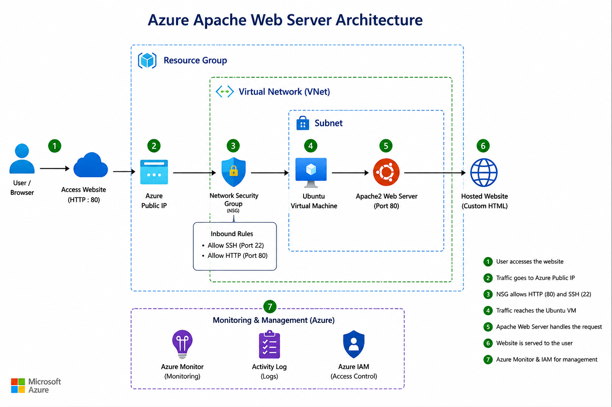
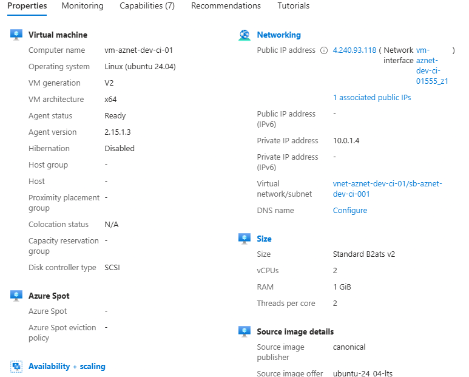
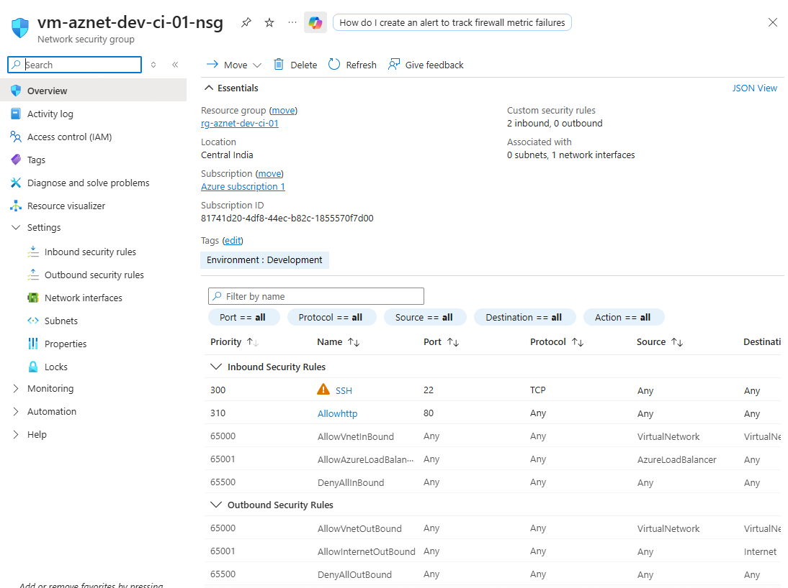
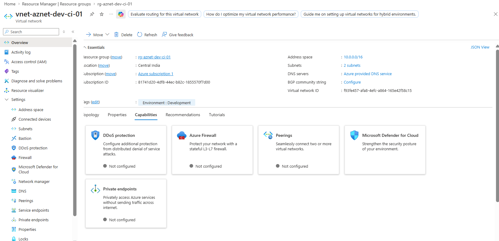
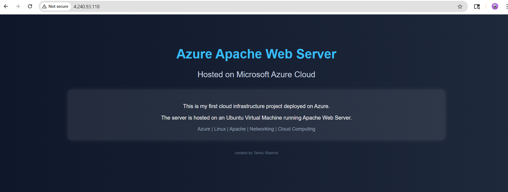

# Azure Apache Web Server Project

## Project Overview

This project demonstrates deployment of a Linux-based Apache web server on Microsoft Azure.

The infrastructure includes:
- Azure Virtual Network (VNet)
- Subnet configuration
- Network Security Group (NSG)
- Ubuntu Virtual Machine
- Apache Web Server
- Public web hosting

---

## Technologies Used

- Microsoft Azure
- Ubuntu Server 24.04
- Apache2
- Azure Networking
- Linux
- GitHub

---

## Architecture



---

## Project Workflow

1. Created Azure Resource Group
2. Configured Virtual Network and Subnet
3. Deployed Ubuntu Virtual Machine
4. Configured NSG rules for SSH and HTTP
5. Installed Apache Web Server
6. Hosted custom HTML webpage
7. Tested public accessibility using Public IP

---

## Screenshots

### Virtual Machine Overview



---

### Network Security Group Rules



---

### Virtual Network



---

### Hosted Webpage



---

## Commands Used

### Install Apache

```bash
sudo apt update
sudo apt install apache2 -y
```

### Start Apache Service

```bash
sudo systemctl start apache2
sudo systemctl enable apache2
```

---

## Learning Outcome

- Learned Azure networking fundamentals
- Understood NSG security rules
- Configured Linux server on Azure
- Hosted website using Apache
- Practiced SSH connectivity
- Built cloud portfolio project

---

## Author

Tannu Sharma